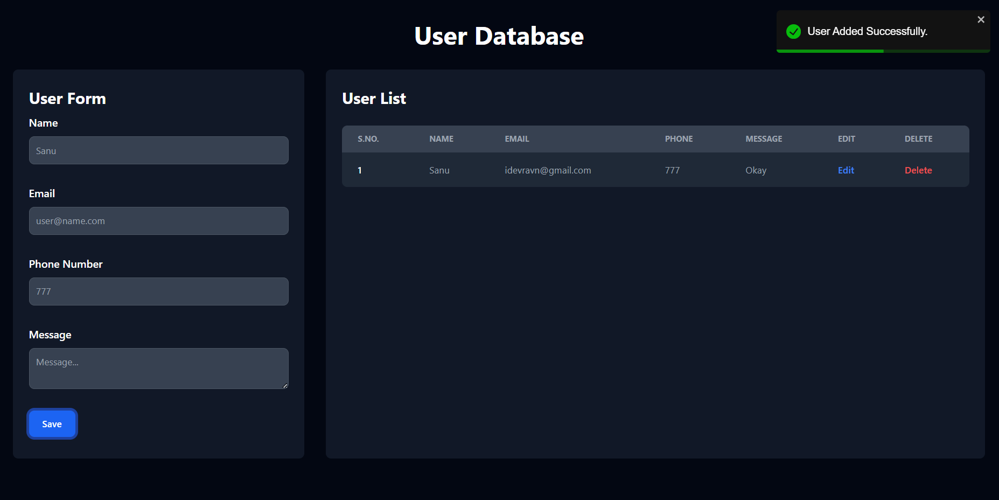

# 👤 userEnquiry

<div align="center">
  <!-- Frontend -->
  
  
  
  

  <!-- Backend -->
  
  
  
  

  <!-- Deployment -->
  
  
</div>

## 🤖 Introduction

**userEnquiry** is a full-stack web application that allows users to submit enquiries through an interactive form. The frontend is built with React (deployed on Vercel) for a modern and responsive UI, while the backend is powered by Express.js + MongoDB (deployed on Render) to handle and store user submissions securely.



## 🚀 Live Demo

[👉 View Live](https://user-enquiry-mern-pi.vercel.app/)

## Features

- ➕ Add User to MongoDB Database
- ✏️ Edit User details in the database
- ❌ Delete User from the database
- 👀 View All Users in the database
- 📦 REST API integration between frontend and backend
- ☁️ Cloud deployment (React on Vercel, Express/MongoDB on Render)

## 🤸 Getting Started

### 1️⃣ Clone the Repository

```bash
git clone https://github.com/idevRavn/userEnquiry-mern.git
cd userEnquiry-mern
npm install
```

### 2️⃣ Development Mode

```bash
npm run dev
```

📌 Open **http://localhost:5173** in your browser to view the site.

## 🛠️ Tech Stack

- React.js
- Vite
- Tailwind CSS
- Vercel
- Mongodb
- Mongoose
- Express
- Nodejs
- Render

## 🤝 Contributing

Contributions are welcome! If you have ideas for improvement or want to add features, please fork the repository and submit a pull request.
